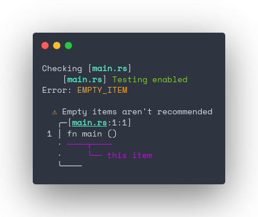

<h1 align="center">cargo-is-tested</h1>
<div align="center">
	<a href="https://github.com/blyxyas/cargo-is-tested">
		
	</a>
	<a href="https://crates.io/crates/cargo-is-tested">
		
	</a>
	<a href="https://docs.rs/cargo-is-tested">
		
	</a>
	<a href="https://blyxyas.github.io/cargo-is-tested">
	
	</a>
</div>
<br>

`cargo-is-tested` is a way to check which of your items are tested and which aren't, very configurable and with a scripting-friendly API ready to use with your Git hooks.

Also, is uses *✨ pretty colors ✨* for error reporting.

**You can also [read the book](https://blyxyas.github.io/cargo-is-tested) for a more user-friendly guide.**

## Example

To check if all functions are tested in the current directory.

```bash
$ cargo is-tested .
```

```toml
# Cargo.toml
# [...]

[dependencies]
is_tested = "*" # Check crates.io for the current version of the crate.

# [...]
```

```rust
// src/main.rs

#! is-tested functions
// Yes, it uses shebangs to enable testing and flags!

use is_tested::is_tested;

#[is_tested("test/myfunction_testing_path.rs")]
fn my_function() {
	// [...]
}
```

Then, it will check if `test/myfunction_testing_path.rs` exists, if it doesn't, it will output an error.

If the file exists, the program checks all lints against your test, assuring the best quality possible. For example, the lint `emptiness` will check that your functions aren't empty.

<div align="center">

</div>

## Installation and usage

To get started using `cargo-is-tested`, install the binary.

```bash
$ cargo install cargo-is-tested
```

Now [document yourself](https://docs.rs/cargo-is-tested/latest/cargo-is-tested/lints) about all the lints you can apply to your tests. You can also use `strict` to activate them all (currently, recommendable)

More lints will be added with time.

---

Once you know the lints you want to apply, import the attribute `is_tested`, then choose a struct, function or any item that you want to test, and add to that item the attribute `#[is_tested("<path to the test>.rs")]`

The result should be something like:

```rust
#! is-tested strict

use is_tested::is_tested;

#[is_tested("tests/mystruct.rs")]
struct MyStruct<'a> {
	string: &'a str
}
```

Don't worry, the attribute won't change anything in your code, it's just a marker for a later-parser to know that you're testing the item.

---

It's time to run the parser, it will read check that all tested items are tested, and with the correct code quality dicted using the lints.

```rust
// tests/mystruct.rs

use mycrate::MyStruct;

fn main() {
	// [...]
}
```

```bash
$ cargo is-tested .
```

This will check that all tests are well written. You can use flags to customize your experience, for example, use `--structs` to check that all structs have tests associated, or use `--test` to, if all tests are confirmed, run `cargo test` automatically.

---

### Stargazers

[](https://github.com/blyxyas/cargo-is-tested/stargazers)

### License

`cargo-is-tested` uses the **MIT License**, 2023.
You can check the [LICENSE](https://github.com/blyxyas/cargo-is-tested/blob/master/LICENSE) for more information about licensing.